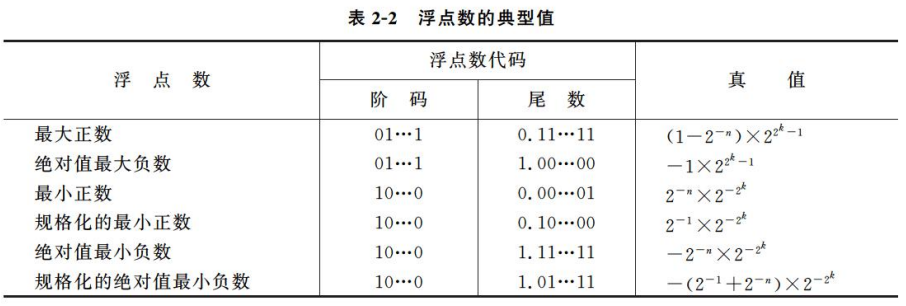

# 第二节 机器数的定点表示与浮点表示

算术运算时需要指明小数点的位置，  
因此根据小数点位置是否固定，有两种对小数的表示方法。

1. 定点表示法
2. 浮点表示法

## 一、定点表示法

操作数数据格式中小数点的位置是固定的。  
计算机中的定点数只采用**纯整数**或者**纯小数**表示。

## 二、浮点表示法

即为小数点会改变位置的表示方法。

可以将小数用如下形式表示：  
$$
N=M\times r^E
$$
其中：

* 基数$r$是常数，通常$r=2$，也可以为$2^n$。  
* 尾数$M$，一般为纯小数$\textrm{?.xxx}$。
* 阶码$E$，反应小数点的实际位置。

故可将浮点数记为$<\textrm{阶码}E,\textrm{尾数}M>$。

将阶码和尾数均采用补码来表示，故浮点数一般为一下格式。
  

需要知道：浮点数中精度和表示范围是两者冲突的。  
范围由阶码$E$影响；精度由位数$M$影响。  
*补充：对于基数$r$，其越大，则表示范围越大，而精度越低。*

同时浮点数的正负性也由尾数的正负性决定。

### 1. 浮点数表示范围

表示范围如下图：  
  

可以看到，浮点数会存在一个最大正数和最小正数（负数一样），  
在趋近无穷和**趋近0**的时候都无法表示。（但可以表示0，此时尾数为0）

*以下负数的最大最小均是指绝对值的负数，最大负数趋近负无穷、最小负数趋近0。*

* 最大正数：尾数$M$为最大正数、阶码$E$为最大正数。
* 最小正数：尾数$M$为最小正数、阶码$E$为最大负数。
* 最大负数：尾数$M$为最大负数、阶码$E$为最大正数。
* 最小负数：尾数$M$为最小负数、阶码$E$为最大负数。

### 2. 规格化浮点数

要提高数据运算的**精度**，就要充分利用尾数的有效位数。  
因此规格化限制：**尾数的最高数位必须为1**。【虽然这句话我看不懂orz……

规格化浮点数的尾数$M$应在下面的范围内：
$$
\frac{1}{r}\le|M|<1
$$
即对于$r=2$，必须左移右移趋近于$(\textrm{0.1xxxxx})_2$的形式，直到不能再移。

> e.g.
>
> $(0.000011)_2\to(0.1011000)_2\times2^{-3}$，为规格化数  
> $(0.000011)_2\to(0.0101100)_2\times2^{-2}$，非规格化数  
> $(1.000000)_2$，规格化数  
> $(1.111111)_2$，非规格化数

---

对于溢出的处理：

* 出现上溢时，需要中止运算操作、进行溢出处理。
* 出现下溢时，一般不做特别处理、直接将结果置为机器零即可（完全的0）。

虽然只要尾数为$0$就可以代表机器零，  
但为了保证$0$的唯一性，通常规定阶码要为最小值（绝对值最大的负数）。

### 3. 阶码的移码表示法

> 问题 - 为什么要引入移码：
>
> 补码有个最重要的问题就是：不好直接根据编码比较大小。
> 比如`0111`(7)>`1000`(-8)，但直接按编码来看应该是`1000`最大。
>
> 原本补码的正负不是按顺序来的，从上（全0）到下（全1）依次是：  
> 0→最小正数→最大正数→最大负数→最小负数
>
> 由于机器码的循环性，若将上面的顺序平移一下，则可变为：
> 最大负数→最小负数→0→最小正数→最大正数
>
> 此时便可以直接根据编码来判断大小了。

* 移码：在真值$X$上加一个常数（偏置值），使数据的正负符号数字化的一种编码方法。

